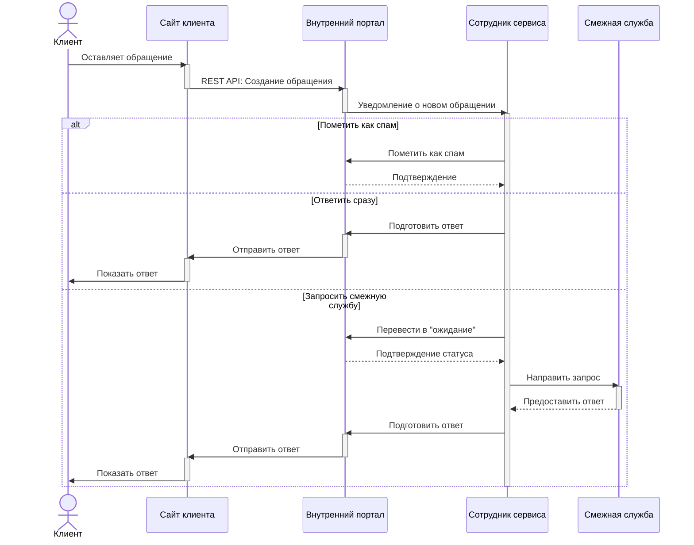

```mermaid
sequenceDiagram
    actor Клиент
    participant СайтКлиента as Сайт клиента
    participant ВнутреннийПортал as Внутренний портал
    participant Сотрудник as Сотрудник сервиса
    participant СмежнаяСлужба as Смежная служба
    
    Клиент->>СайтКлиента: Оставляет обращение
    activate СайтКлиента
    СайтКлиента->>ВнутреннийПортал: REST API: Создание обращения
    deactivate СайтКлиента
    
    activate ВнутреннийПортал
    ВнутреннийПортал->>Сотрудник: Уведомление о новом обращении
    deactivate ВнутреннийПортал
    
    activate Сотрудник
    alt Пометить как спам
        Сотрудник->>ВнутреннийПортал: Пометить как спам
        ВнутреннийПортал-->>Сотрудник: Подтверждение
    else Ответить сразу
        Сотрудник->>ВнутреннийПортал: Подготовить ответ
        activate ВнутреннийПортал
        ВнутреннийПортал->>СайтКлиента: Отправить ответ
        deactivate ВнутреннийПортал
        activate СайтКлиента
        СайтКлиента->>Клиент: Показать ответ
        deactivate СайтКлиента
    else Запросить смежную службу
        Сотрудник->>ВнутреннийПортал: Перевести в "ожидание"
        ВнутреннийПортал-->>Сотрудник: Подтверждение статуса
        
        Сотрудник->>СмежнаяСлужба: Направить запрос
        activate СмежнаяСлужба
        СмежнаяСлужба-->>Сотрудник: Предоставить ответ
        deactivate СмежнаяСлужба
        
        Сотрудник->>ВнутреннийПортал: Подготовить ответ
        activate ВнутреннийПортал
        ВнутреннийПортал->>СайтКлиента: Отправить ответ
        deactivate ВнутреннийПортал
        activate СайтКлиента
        СайтКлиента->>Клиент: Показать ответ
        deactivate СайтКлиента
    end
    deactivate Сотрудник
```
